# Spotify Analytics (Kaggle + Python + PostgreSQL + Docker)

I wanted to see what *actually* lines up with popularity on Spotify — energy, danceability, loudness, tempo, mood — across ~30k tracks.  
This is a small end-to-end build: Dockerised Postgres, a tidy schema, simple SQL, and a notebook full of 16 clean visuals.

## What’s inside
- **PostgreSQL (Docker)** for storage + queries  
- **ETL** from CSV → staging → normalized (artists, albums, tracks)  
- **Python (Pandas/Matplotlib/Seaborn)** for analysis/plots  
- **SQL views** for reusable summaries  
- All charts saved in `/figures`

## Data
Kaggle: 30,000 Spotify songs — track/artist/album info, playlist (sub)genres, and audio features (danceability, energy, valence, loudness, tempo), plus a popularity score.

## A few takeaways
- Energy and loudness correlate best with popularity; tempo on its own doesn’t.
- “Hits” (top 5%) are a bit faster, louder, more energetic/positive.
- Instrumentals trend lower on popularity overall, but have strong niches.
- Artists with smaller catalogues often have higher average popularity.
- Playlists ~100–200 tracks look like a sweet spot.

## Charts

<details>
  <summary><strong>Tempo ranges per subgenre (stacked bars)</strong></summary>

  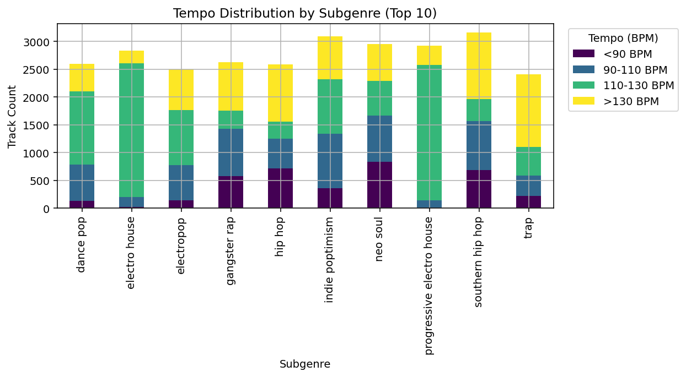
</details>

<details>
  <summary><strong>Song length spread (boxplot)</strong></summary>

  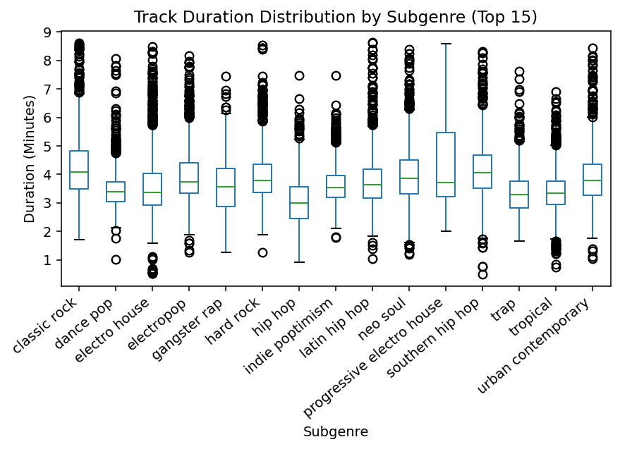
</details>

<details>
  <summary><strong>Which features move together (incl. popularity)</strong></summary>

  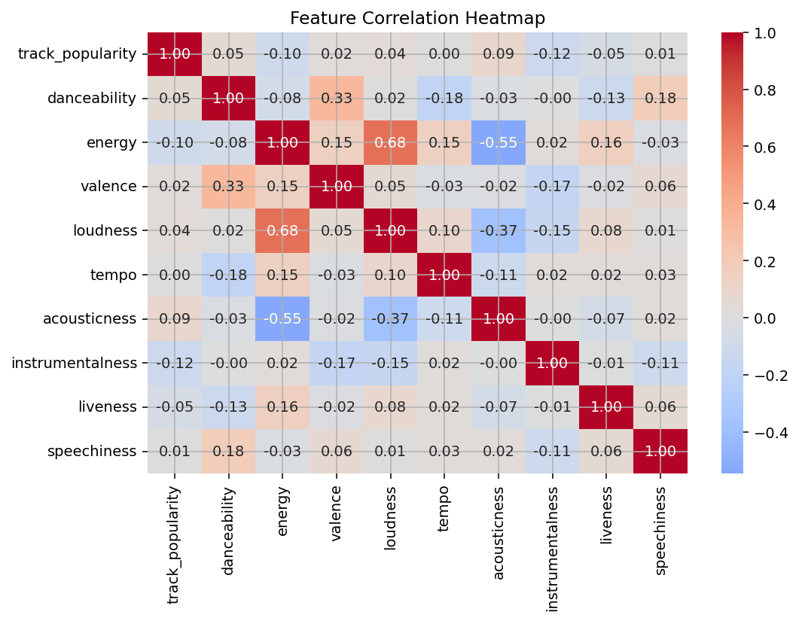
</details>

<details>
  <summary><strong>Louder generally = higher energy (with trendline)</strong></summary>

  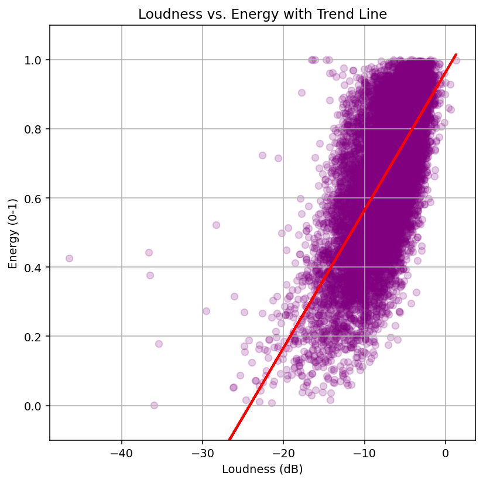
</details>

<details>
  <summary><strong>Top 5% vs others (grouped bars)</strong></summary>

  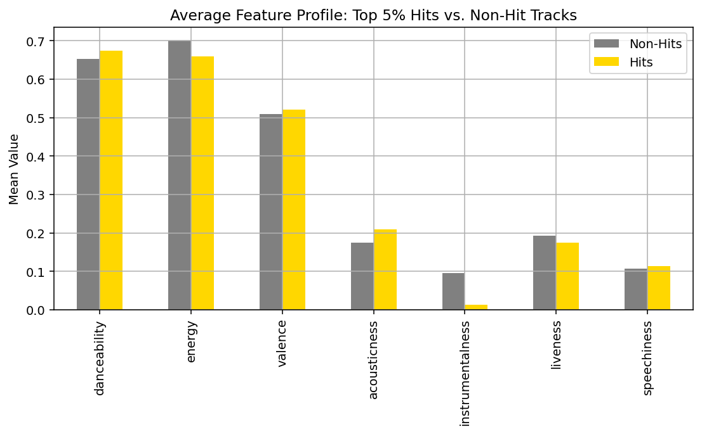
</details>

<details>
  <summary><strong>Do instrumentals perform? (binned line)</strong></summary>

  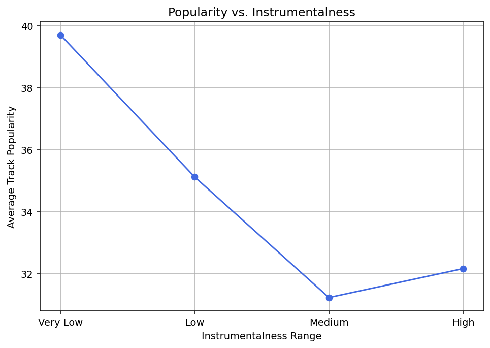
</details>

<details>
  <summary><strong>Bigger isn’t always better (bubble plot)</strong></summary>

  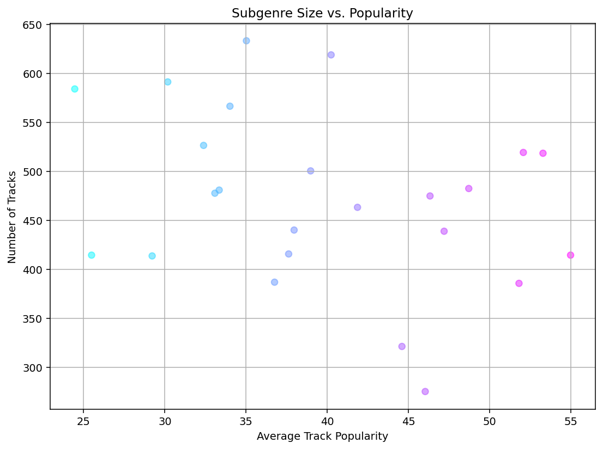
</details>

<details>
  <summary><strong>Output vs average popularity</strong></summary>

  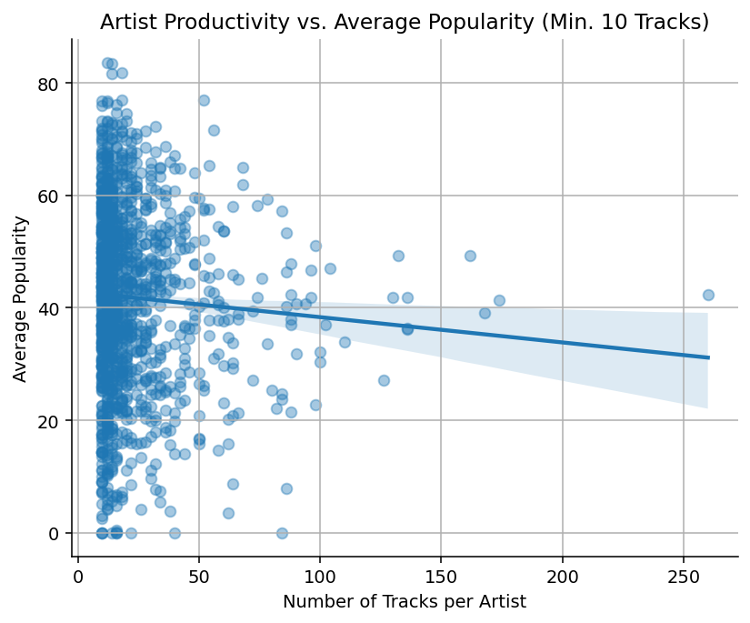
</details>

<details>
  <summary><strong>Quick “mood map”</strong></summary>

  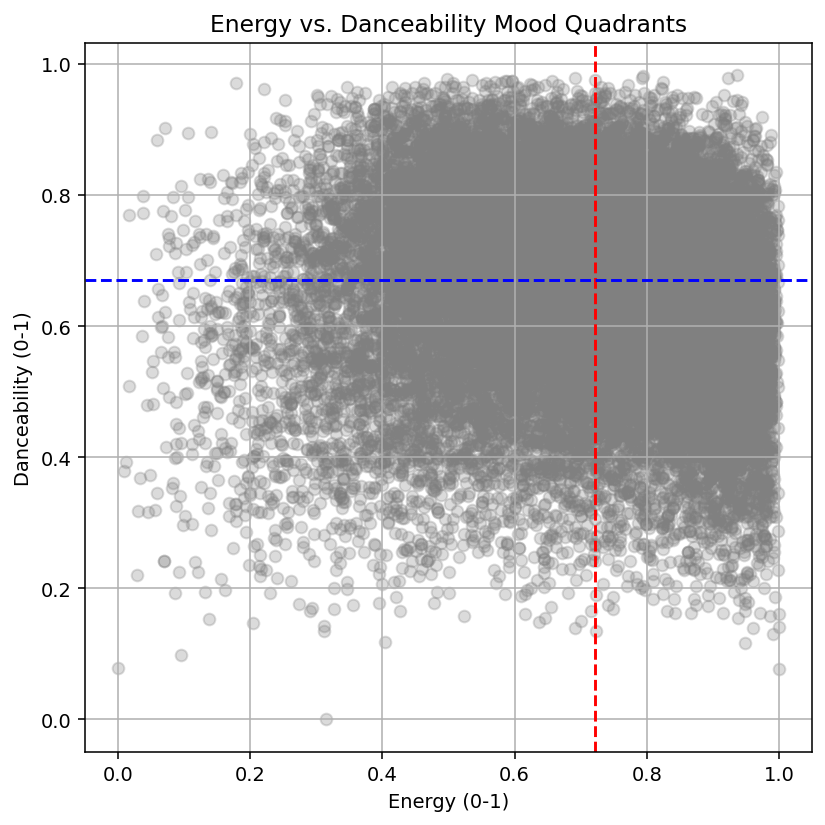
</details>

<details>
  <summary><strong>Playlist size bins vs avg popularity (violin)</strong></summary>

  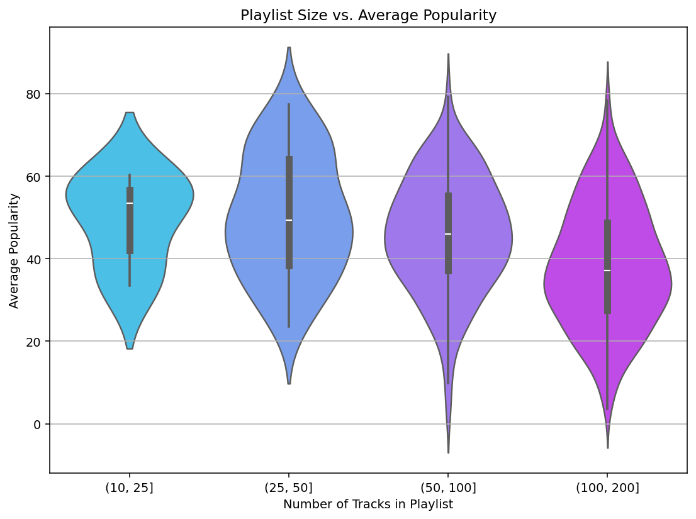
</details>

<details>
  <summary><strong>Danceability / Energy / Valence profiles</strong></summary>

  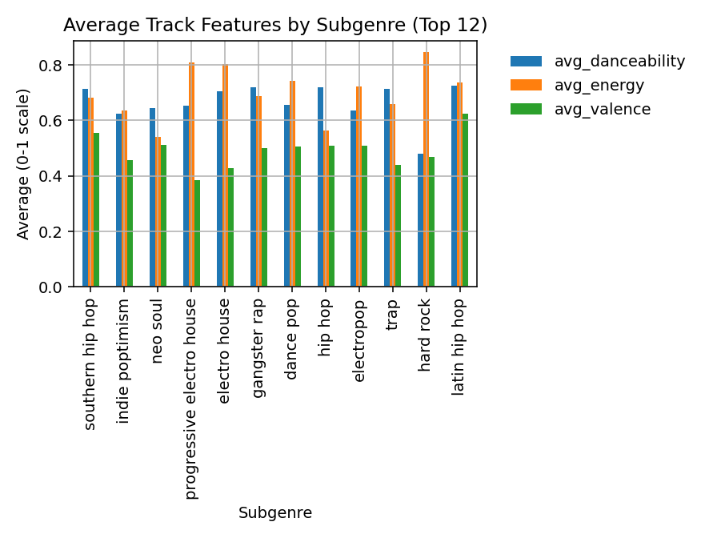
</details>

<details>
  <summary><strong>p50 / p75 / p90 popularity by subgenre</strong></summary>

  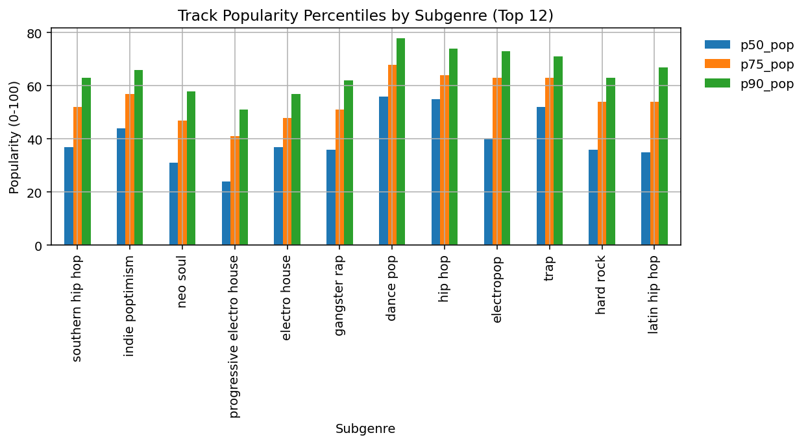
</details>

<details>
  <summary><strong>Common musical keys / modes</strong></summary>

  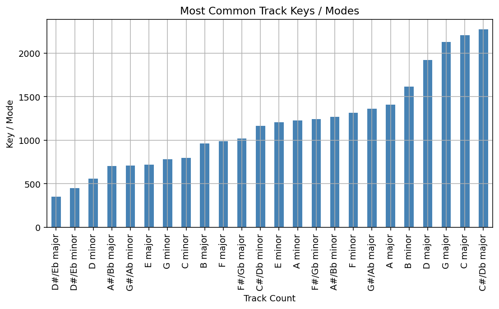
</details>

<details>
  <summary><strong>Average popularity for artists (min tracks rule)</strong></summary>

  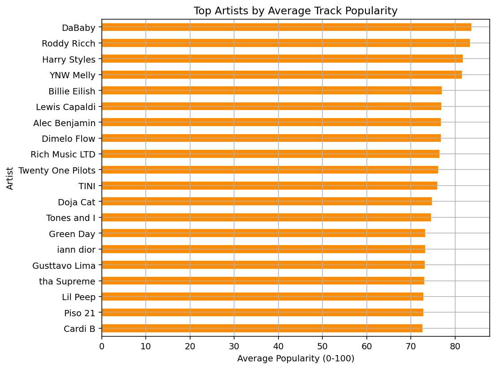
</details>

<details>
  <summary><strong>Mood vs intensity scatter</strong></summary>

  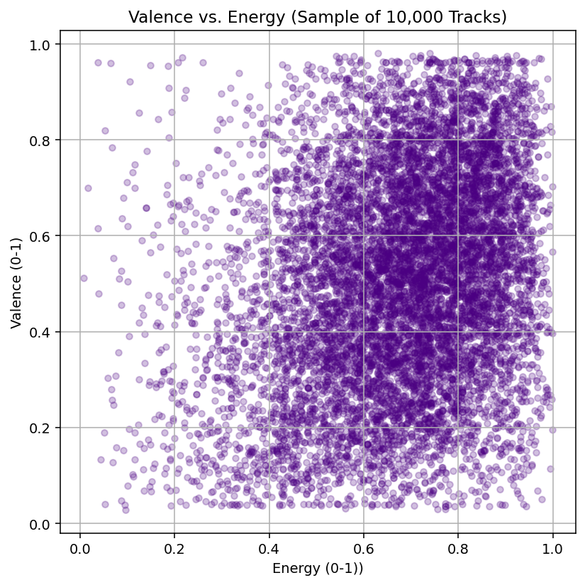
</details>

<details>
  <summary><strong>Feature trends across years (where dates exist)</strong></summary>

  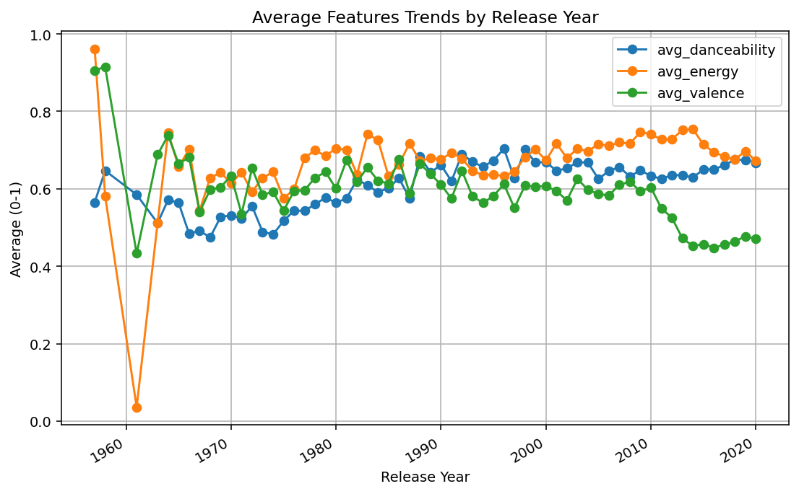
</details>


## Run it
```bash
# Postgres
docker run --name spotifypg -e POSTGRES_PASSWORD=postgres -p 5432:5432 -d postgres:16
# Python
pip install -r requirements.txt
# Notebook
jupyter lab  # open notebooks/03_analysis.ipynb
